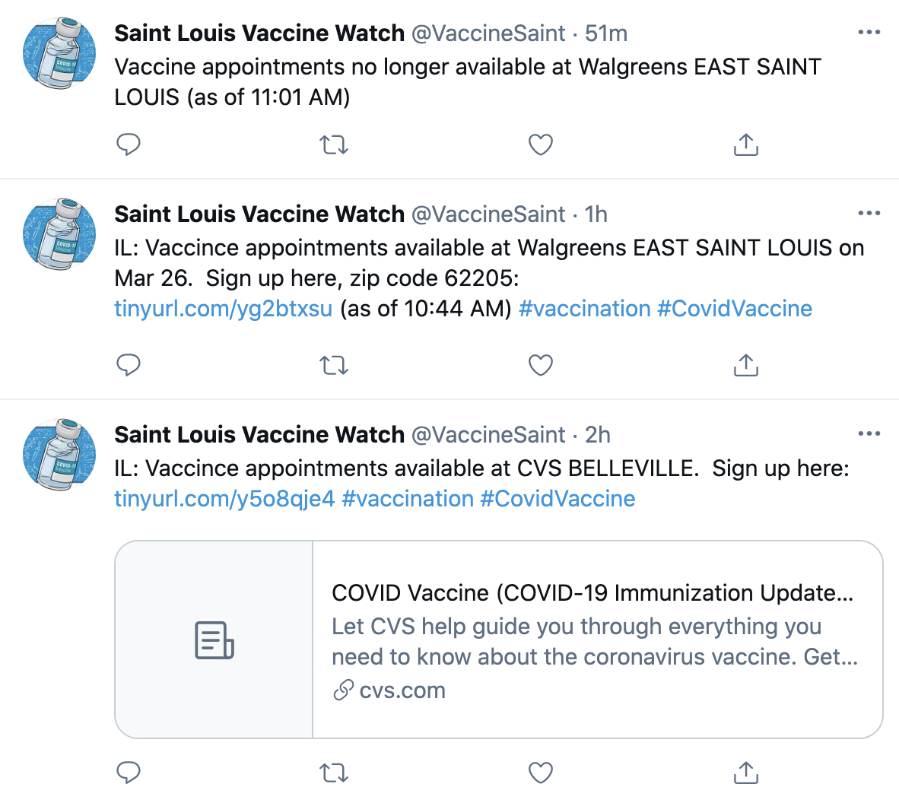

# jvwatch
SpringBoot port of @pcarn [vaccine-watch](https://github.com/pcarn/vaccine-watch). Thanks @pcarn for the great initial python project.

Although this bot app duplicates much of the functionality in the python based vaccine-watch, it is not 
the purpose of this app to create yet another bot as the original vaccine-watch already fills in that value 
space.  Instead, this application is intended to be more of a learning application to illustrate 
how Spring technologies can facilitate creating service based applications in a highly productive manner.  It
has the advantage of using a "real" real world use case vs learning from a sample application that implements a
widget use case.  When built and deployed, this application provides real world value using live production data sources
and publishes to live production destination.

## Example

The following is an example Twitter feed publishing vaccine appointments.

 

## Setup

* Install at minimum Java JDK 8
* Clone this repository: `git clone https://github.com/gm2552/jvwatch.git`
* Go to the repository directory and build the application: `mvnw clean package`

## Deployment and Configuration

The application will be in the `<current dir>/jvwatch>/target` sub directory and named `jvwatch-<version>-SNAPSHOT.jar`.  Copy
this jar file to the location of where you wish to run the application.

You will want to create an application.yml file to same directory where you copied the application jar file.

The following is an example application.yml file that enables reading from 2 states in a particular location
and, disables reading appointment from HyVee, and posts appointment to twitter:

```
jvwatch:
  states: MO,IL
  radius: 25
  latitude: '38.6516763'
  longitude: '-90.3430342'
  clinics:
    cvs:
      cities: SAINT LOUIS,ST. LOUIS,BALLWIN,BELLEVILLE
    hyvee:
      enabled: false
  notifications:
    twitter:
      enabled: true
      oauth:
        consumerKey: <redacted>
        consumerSecret: <redacted>
        accessToken: <redacted>
        accessTokenSecret: <redacted>
```

### Twitter Configuration

To post to twitter, you will need to enable the twitter publisher and provide the API keys as shown in the example above.  You will need
to enable developer privs on your twitter account to obtain the necessary keys, secrets, and tokens.

### Required Global Configuration

The application contains default values for the states, latitude, longitude, and search radius, but you will want to update these.  Use the following settings
in the application.yml file.

* `jvwatch.states`: Abbreviations of which states are in radius of your location (e.g. ["MO", "KS"])
* `jvwatch.radius`: Within how many miles to check
* `jvwatch.latitude`: Latitude of the location to check (e.g. 39.1040382)
* `jvwatch.longitude`: Latitude of the location to check (e.g. -94.5701803)
* `jvwatch.checkTask.period`:  How often clinics are checked in milliseconds.  Default to 120000 (2 minutes).

### Optional Clinic Configuration

By default, all clinics are enabled, but can be disabled by setting the appropriate `enabled` property to false.

- CVS: 
  - `jvwatch.clinics.cvs.enabled`
  - `jvwatch.clinics.cvs.cities` Comma delimited list of cities (in all caps) that will be included in the appointment list.  
- HyVee:
  - `jvwatch.clinics.hyvee.enabled`
- Walmart:
  - `jvwatch.clinics.walmart.enabled`
- Wallgreens:
  - `jvwatch.clinics.wallgreens.enabled`
  
### Redis and RabbitMQ

This application uses Redis for state information and RabbitMQ for handing off data from the clinic data retrievers to the publishers
(useful when deploying the data sources and data publishers in different application instances).  You will need to install Redis and RabbitMQ
on a machine that is accessible by the application.  The easiest way to deploy is to install Redis and RabbitMQ on the same machine as the 
application and use the default settings.  By default, the application attempts to connect to these services on the local machine using the default
port and default security information.  This configuration information can be updated by placing the appropriate config in the application.yml file 
uses the settings outlined in the Spring [Appendix](https://docs.spring.io/spring-boot/docs/current/reference/html/appendix-application-properties.html).

### Run Standalone

The easiest way to run the application is using a simple java -jar command:

```
java -jar jvwatch-<version>-SNAPSHOT.jar
```

Depending the OS you are running on, you can configure this application to run in the background or as a service.

If you have access and the know how, you can also deploy this application on other platforms such as Kubernetes or CloudFoundry.  Details
of these deployments are beyond the scope of this documentation.